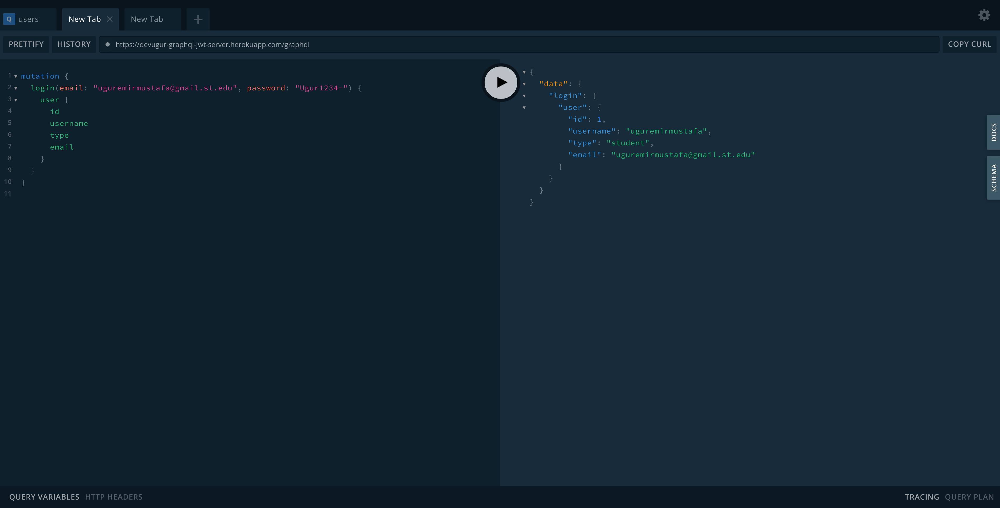

<!--
*** Thanks for checking out the Best-README-Template. If you have a suggestion
*** that would make this better, please fork the repo and create a pull request
*** or simply open an issue with the tag "enhancement".
*** Thanks again! Now go create something AMAZING! :D
***
***
***
*** To avoid retyping too much info. Do a search and replace for the following:
*** uguremirmustafa, graphql-express-jwt-auth-server, uguremirmustafa, uguremirmustafa@gmail.com, graphql-express-jwt-auth-server, Auth server created with GraphQL and Express using JWT.
-->

<!-- PROJECT SHIELDS -->
<!--
*** I'm using markdown "reference style" links for readability.
*** Reference links are enclosed in brackets [ ] instead of parentheses ( ).
*** See the bottom of this document for the declaration of the reference variables
*** for contributors-url, forks-url, etc. This is an optional, concise syntax you may use.
*** https://www.markdownguide.org/basic-syntax/#reference-style-links
-->

<!-- [![Contributors][contributors-shield]][contributors-url]
[![Forks][forks-shield]][forks-url]
[![Stargazers][stars-shield]][stars-url]
[![Issues][issues-shield]][issues-url]
[![MIT License][license-shield]][license-url]
[![LinkedIn][linkedin-shield]][linkedin-url] -->

<!-- PROJECT LOGO -->
<br />
<p align="center">
  <a href="https://github.com/uguremirmustafa/graphql-express-jwt-auth-server">
    
  </a>

  <h3 align="center">graphql-express-jwt-auth-server</h3>

  <p align="center">
    Auth server created with GraphQL and Express using JWT.
    <br />
    <a href="https://github.com/uguremirmustafa/graphql-express-jwt-auth-server"><strong>Explore the docs »</strong></a>
    <br />
    <br />
    <a href="https://github.com/uguremirmustafa/graphql-express-jwt-auth-server">View Demo</a>
    ·
    <a href="https://github.com/uguremirmustafa/graphql-express-jwt-auth-server/issues">Report Bug</a>
    ·
    <a href="https://github.com/uguremirmustafa/graphql-express-jwt-auth-server/issues">Request Feature</a>
  </p>
</p>
<a href="https://github.com/uguremirmustafa/express-graphql-jwt-auth">CLIENT CODE WITH REACT IS HERE</a>

<!-- TABLE OF CONTENTS -->
<details open="open">
  <summary><h2 style="display: inline-block">Table of Contents</h2></summary>
  <ol>
    <li>
      <a href="#about-the-project">About The Project</a>
      <ul>
        <li><a href="#built-with">Built With</a></li>
      </ul>
    </li>
    <li>
      <a href="#getting-started">Getting Started</a>
      <ul>
        <li><a href="#prerequisites">Prerequisites</a></li>
        <li><a href="#installation">Installation</a></li>
      </ul>
    </li>
    <li><a href="#usage">Usage</a></li>
    <li><a href="#roadmap">Roadmap</a></li>
    <li><a href="#contributing">Contributing</a></li>
    <li><a href="#license">License</a></li>
    <li><a href="#contact">Contact</a></li>
    <li><a href="#acknowledgements">Acknowledgements</a></li>
  </ol>
</details>

<!-- ABOUT THE PROJECT -->

## About The Project


graphql-express-jwt-auth-server is built as a boilerplate code for starting graphql applications faster.

### Built With

- [Graphql](https://graphql.org/)
- [apollo-server-express](https://www.npmjs.com/package/apollo-server-express)
- [jwt](https://jwt.io)
- [ioredis](https://github.com/luin/ioredis)
- [typeorm](https://typeorm.io/#/)
- [type-graphql](https://typegraphql.com/)

<!-- GETTING STARTED -->

## Getting Started

To get a local copy up and running follow these simple steps.

### Prerequisites

First of all be sure you have node installed on your computer. You can find detailed instructions [here](https://www.devugur.com/blog/how-to-install-different-node-versions-on-linux) to install node.

- node
  ```sh
  node -v
  ```

I prefer yarn, it is a personal choice.

- yarn
  ```sh
  npm install yarn -g
  ```

As a database, I use postgresql. You can install postgres on your computer or you can create a docker instance with offical postgres image from docker hub. Remember your credientials and put them in `ormconfig.js` file after cloning the repo.

### Installation

1. Clone the repo
   ```sh
   git clone https://github.com/uguremirmustafa/graphql-express-jwt-auth-server.git
   ```
2. Install NPM packages
   ```sh
   yarn
   # OR
   npm install
   ```
3. Move .env.example to .env and fill in the keys

   ```sh
   mv .env.example .env
   ```

4. Start the server and head to [http://localhost:4000/graphql](http://localhost:4000/graphql)
   ```sh
   yarn dev
   # OR
   npm run dev
   ```

<!-- USAGE EXAMPLES -->

## Usage

You can find some screenshots of the project.

### Graphql Playground


<!-- ROADMAP -->

## Roadmap

See the [open issues](https://github.com/uguremirmustafa/graphql-express-jwt-auth-server/issues) for a list of proposed features (and known issues).

<!-- CONTRIBUTING -->

## Contributing

Contributions are what make the open source community such an amazing place to learn, inspire, and create. Any contributions you make are **greatly appreciated**.

1. Fork the Project
2. Create your Feature Branch (`git checkout -b feature/AmazingFeature`)
3. Commit your Changes (`git commit -m 'Add some AmazingFeature'`)
4. Push to the Branch (`git push origin feature/AmazingFeature`)
5. Open a Pull Request

<!-- LICENSE -->

## License

Distributed under the MIT License. See `LICENSE` for more information.

<!-- CONTACT -->

## Contact

Uğur Emirmustafa - [@uguremirmustafa](https://twitter.com/uguremirmustafa) - uguremirmustafa@gmail.com

Project Link: [https://github.com/uguremirmustafa/graphql-express-jwt-auth-server](https://github.com/uguremirmustafa/graphql-express-jwt-auth-server)

<!-- ACKNOWLEDGEMENTS -->

## Acknowledgements

- [typeorm](https://typeorm.io/#/)
- [type-graphql](https://typegraphql.com/)

<!-- MARKDOWN LINKS & IMAGES -->
<!-- https://www.markdownguide.org/basic-syntax/#reference-style-links -->

[contributors-shield]: https://img.shields.io/github/contributors/uguremirmustafa/repo.svg?style=for-the-badge
[contributors-url]: https://github.com/uguremirmustafa/graphql-express-jwt-auth-server/graphs/contributors
[forks-shield]: https://img.shields.io/github/forks/uguremirmustafa/repo.svg?style=for-the-badge
[forks-url]: https://github.com/uguremirmustafa/graphql-express-jwt-auth-server/network/members
[stars-shield]: https://img.shields.io/github/stars/uguremirmustafa/repo.svg?style=for-the-badge
[stars-url]: https://github.com/uguremirmustafa/graphql-express-jwt-auth-server/stargazers
[issues-shield]: https://img.shields.io/github/issues/uguremirmustafa/repo.svg?style=for-the-badge
[issues-url]: https://github.com/uguremirmustafa/graphql-express-jwt-auth-server/issues
[license-shield]: https://img.shields.io/github/license/uguremirmustafa/repo.svg?style=for-the-badge
[license-url]: https://github.com/uguremirmustafa/graphql-express-jwt-auth-server/blob/master/LICENSE.txt
[linkedin-shield]: https://img.shields.io/badge/-LinkedIn-black.svg?style=for-the-badge&logo=linkedin&colorB=555
[linkedin-url]: https://linkedin.com/in/uguremirmustafa
